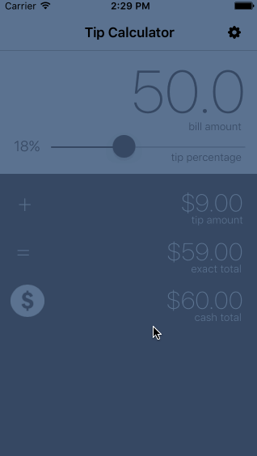

# Pre-work - *TIP*

**TIP** is a tip calculator application for iOS.

Submitted by: **Muin Momin**

Time spent: **20** hours spent in total

## User Stories

The following **required** functionality is complete:
* [x] User can enter a bill amount, choose a tip percentage, and see the tip and total values.

The following **optional** features are implemented:
* [x] Settings page to change the default tip percentage.
* [x] UI animations
* [x] Remembering the bill amount across app restarts (if <10mins)
* [ ] Using locale-specific currency and currency thousands separators.
* [x] Making sure the keyboard is always visible and the bill amount is always the first responder. This way the user doesn't have to tap anywhere to use this app. Just launch the app and start typing.

The following **additional** features are implemented:

- [x] Added slider for finer tip control instead of only choosing from 3 values.
- [x] Cash total feature. If user is paying in cash, they won't be able to pay 27.56, instead they'll just pay 28.00. My application also displays this cash value. Also, for some values like 59, it's easier to just pay 60.
- [x] Dismissing keyboard (more info in gif below)
- [x] Added icon and loading screen backsplash
- [x] Made UI better by using colors and moving elements around

## Video Walkthrough 

Here's a walkthrough of implemented user stories:

This is the main overiview of the application. More specific gifs below.  

I used a slider instead of segmentedcontroller because slider provides more control. Also, the default slider was hard to control, so I used [OBSlider](https://github.com/ole/OBSlider) instead. This allows the user to get even more precise control over the slider by simply dragging their finger down (as show in gif).  

This is the starting of the app. Keyboard automatically shows up so the user can just start typing.  

Settings screen to change the default tip value.  

When there is no input for bill amount, tapping outside will not dismiss the keyboard. But when the user enters in input and THEN taps outside, the keyboard will be dismissed. This way, the user will not get confused when they see blank input without a keyboard.  

GIF created with [LiceCap](http://www.cockos.com/licecap/).

## Notes

Describe any challenges encountered while building the app:  

 - I didn't really like the slider that comes with UIKit, so I had to look for something else and use that instead.  
 - Hadn't really done much Swift/iOS programming before this, so I had to do a lot of research for keeping data persistent and plugging into different life cycles of the app.

Credits:

 - App logo: http://www.flaticon.com/free-icon/more-percentage-plus-button_60867#term=plus-money&page=1&position=3
 - Settings logo: http://www.flaticon.com/free-icon/settings-cog_17214

## License

    Copyright 2015 Muin Momin

    Licensed under the Apache License, Version 2.0 (the "License");
    you may not use this file except in compliance with the License.
    You may obtain a copy of the License at

        http://www.apache.org/licenses/LICENSE-2.0

    Unless required by applicable law or agreed to in writing, software
    distributed under the License is distributed on an "AS IS" BASIS,
    WITHOUT WARRANTIES OR CONDITIONS OF ANY KIND, either express or implied.
    See the License for the specific language governing permissions and
    limitations under the License.
